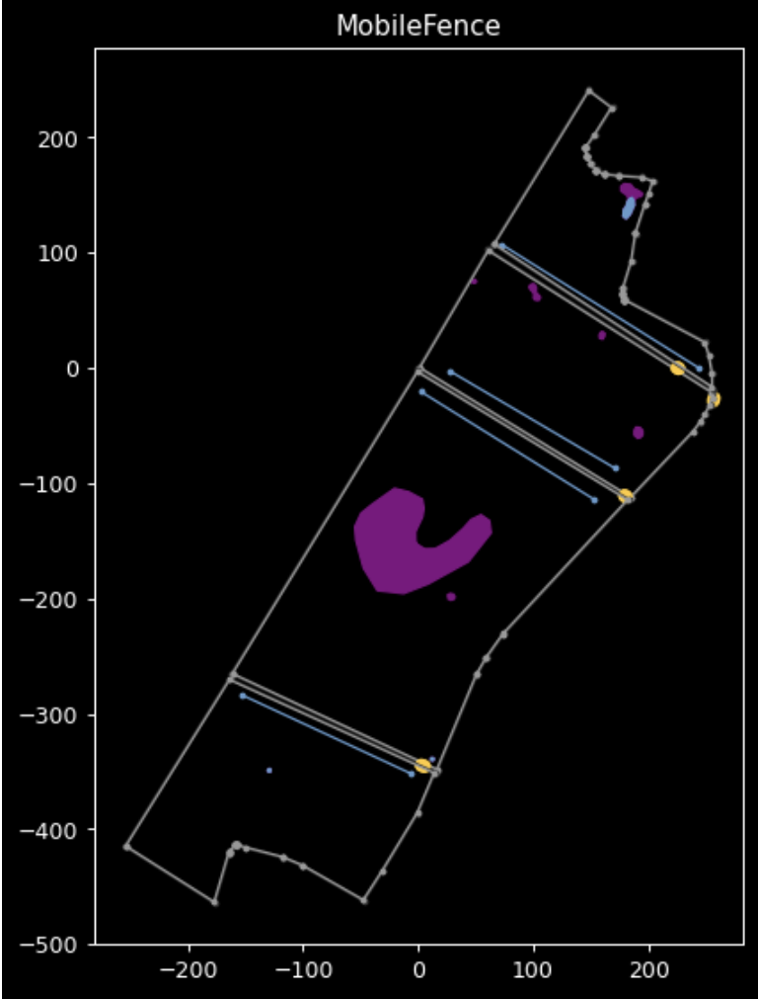
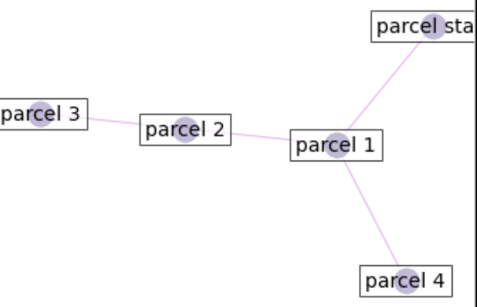
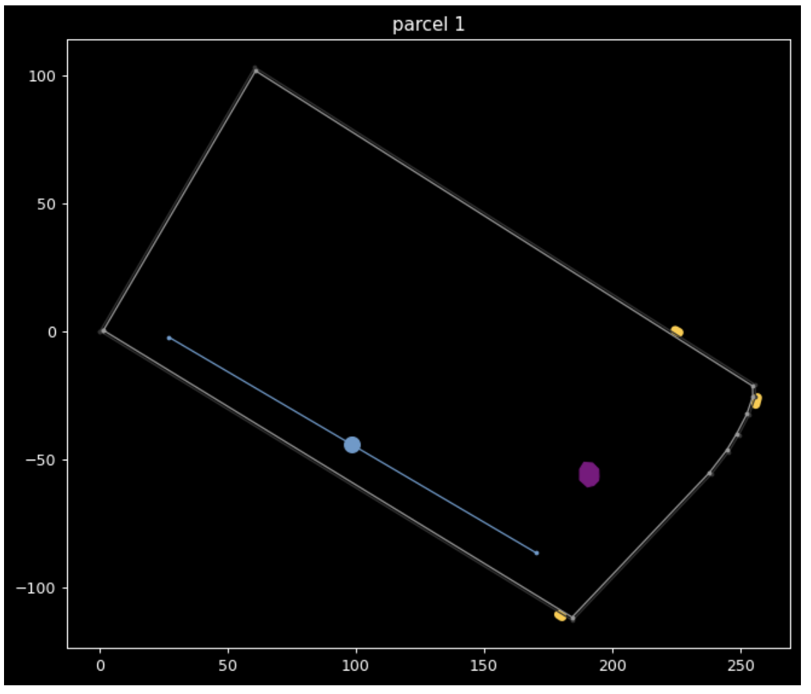

# Linear Path Planner for Guided Grazing

Introducing the Linear Path Planner. Previous open source work at Avalanche to develop a physical fence robot for cattle and cows management to end over-grazing and yield up to 90% of hay excess.


https://user-images.githubusercontent.com/18560386/164186889-5160a54d-dbb7-400c-9644-284d7deef19a.mp4

# How does it work?

[](https://www.figma.com/proto/dmTIbV9pCkTJNlniaIH6AF/path_planner_v0?node-id=1%3A2)
[Figma Presentation](https://www.figma.com/proto/dmTIbV9pCkTJNlniaIH6AF/path_planner_v0?node-id=1%3A2)

# Testing the Path Planner


The entire workflow is detailed in `notebook/PathPlanner.ipynb`.
Let's run the planner on a new parcel.

## 1. Creating the KML File

First, head to Google Earth and create a mapping respecting the following requirements:


### 1.1 Parcel
Create closed Polygons representing the fields of interest. 
Naming is important because it will be used later by the GoogleEarthParser. <br>
Naming: `Parcel {index} - Perimeter`.
- Parcel 1 - Perimeter
- Parcel 2 - Perimeter
- Parcel 3 - Perimeter
- Parcel 4 - Perimeter

### 1.2 Obstacles
Add the obstacles within your Polygon by drawing (you guess it) another set of Polygons. <br>
Naming: `Parcel {index 1} - Obstacle {index 2}`. Exemple:
- Parcel 1 - Obstacle 1
- Parcel 1 - Obstacle 2

### 1.3 Sweep axis
Add the Sweep axis by drawing a line. It will determine the orientation of our fences. <br>
Naming: `Parcel {index} - Sweep axis`. <br>
Note that you must assign only one sweep axis per field.

### 1.4 Gates
Joint parcels can be separated by gates, allowing communication between the two spaces. <br>
You can add gates as small lines. <br>
Naming: `Gate {parcel index 1}-{parcel index 2}`
You can also specify the entrance to the group of parcel by choosing a starting gate. <br>
Naming: `Gate Start-{parcel index}`

### 1.5 Water tanks
Water tanks and food tanks are essential to cow well-being. As these installations can be of great sizes, we need to take them into account like obstacles. <br>
Note that the planner will take as default starting point the center of the first water tank. For now indicate only one water tank and set the rest as obstacles. <br>
Naming: `Parcel {parcel index} - WaterTank`

### 1.4 Export
Finally, export the file as KML using the Google Earth UI.

## 2. Setup the environment

- Requirements: python > 3.6

1. The next step is to install the Linear Path Planner locally and create the python environment.
Clone the repo, and then `cd` into it.

2. Then install packages by running:
```
python3 -m venv venv && source venv/bin/activate
pip install -r requirements.txt
```

3. Afterwards, create a folder like `prod` or `test` and place your KML File in it.
4. Finally, open the `NewPathPlanner.ipynb` notebook. <br>
  Run `jupyter notebook notebook/NewPathPlanner.ipynb --log-level=CRITICAL&` to create a background thread and filter the log messages on terminal.
  You can also create a new notebook in the `notebook` directory and open it.

## 3. Run the Planner!

Follow along if you have opened the `NewPathPlanner`, or use the high level API if you are creating a new notebook.
The main workflow is:

### 3.1. Parse the KML File

Parse the KML File into a parcel group instance. Set the working directory first in the class instantiation.

```python
import sys; sys.path.append("..") # house keeping to make our imports work
from src.parsing.google_earth_parser import GoogleEarthParser

parser = GoogleEarthParser(workdir="../prod")
parcel_group = parser.get_parcel_group("../prod/MobileFence.kml")
parcel_group.plot_parcels()
parcel_group.plot_graph()
```
[](img/parcel_group_plot.png)
<br>
[](img/graph_plot.png)

`parcel_group` is an instance of `ParcelGroup` with the following methods:
<br>

`parcel_group.plot_parcels()` <br>
Display all the parcel within the ParcelGroup. It will show Parcel perimeter, along with obstacles and sweep axis.
<br><br>

`parcel_group.plot_graph()` <br>
Display all the connections between parcels contained in ParcelGroup.
<br><br>

`parcel_group.rotate_sweep_axis()` <br>
[Optional] Rotate all objects in such way that the sweep axis is horizontal. This is required to perform a discretization of the figure, that is converting it into a matrix. <br><br>

`parcel_group.convert_binary()` <br>
[Optional] Convert the Parcel and its element into a matrix. This make the bridge between our geometric and coordinates approach to a matrix one.


### 3.2. Choose a parcel

Choose a parcel to perform path planning on.

```python
parcel_1 = parcel_group.dict_parcel["parcel 1"]
parcel_1.plot()
```



### 3.3. Run the path planner


```python
fleet = Fleet("../prod")
fleet.forward(parcel_1)
fleet.plot()
fleep.make_gif()
```

### 3.3. Edit the parcel object [Optional]

Every item of a parcel is a Geometric element using the shapely library. <br>
You can easily edit those items to test different configuration.

For exemple, the starting point (`parcel.start_point`) is defined as the center of the first water tank, but you can choose it to be the center of the sweep axis instead.


```python
parcel_1.water_tanks = [parcel_1.ls_sweep_axis.centroid.buffer(3)]
```

Here, water_tanks need to be a list of Polygon, so we take the centroid of our sweep axis, and make it a disk of radius 3 unit (hence, a Polygon).

See [shapely documentation](https://shapely.readthedocs.io/en/stable/manual.html) for more operation on shapely objects.